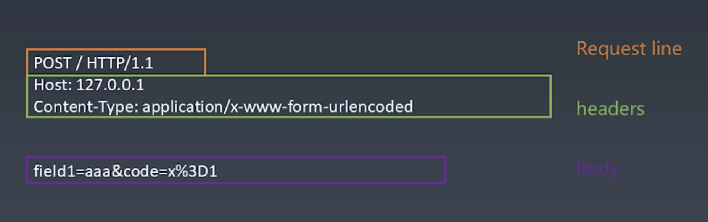
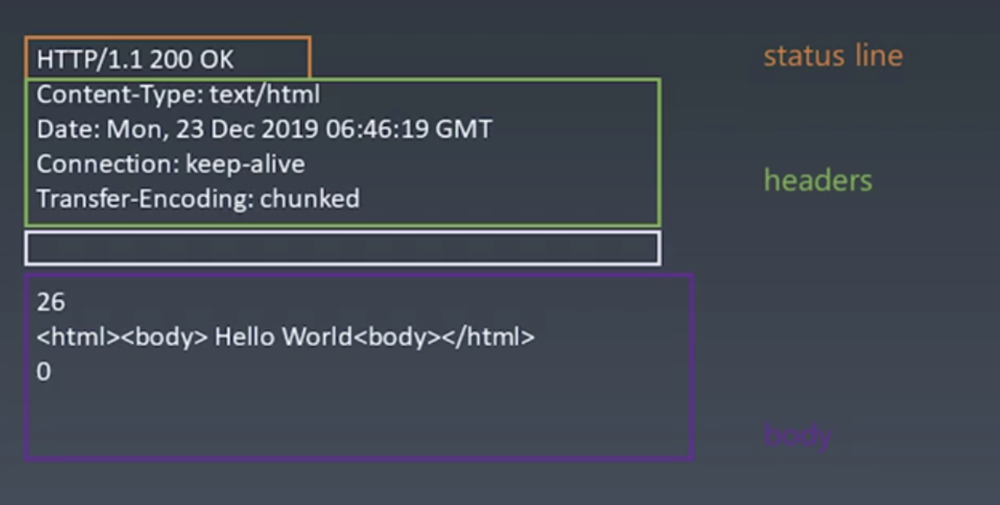

学习笔记

## 有限状态机

+ 每个状态都是一个机器
  + 每个机器都可以进行计算、存储、输出...
  + 所有机器接受的输入必须一致
  + 每个机器本身没有状态，如果用函数来表示，必须没有副作用
+ 每个机器知道下一个状态是什么
  + 有确定的下一个状态（Moore）
  + 根据输入决定下一个状态（Mealy）


```js
// JS中的有限状态机（Mealy）

// 每个函数是一个状态
function state(input)
{
  // ...处理逻辑
  return next; // 返回下一个状态
}

// 调用
while(input) {
  // 获取输入
  state = state(input) // 把状态机的返回值作为下一个状态
}
```


## 浏览器实现原理

浏览器实现过程：

+ 浏览器首先使用 HTTP 协议或者 HTTPS 协议，向服务端请求页面；
+ 把请求回来的HTML代码进行解析，构建DOM树
+ 计算DOM树上的CSS属性
+ 根据CSS属性对元素逐个进行渲染，得到内存中的位图
+ 可选步骤：对位图进行合成（可以极大增加后续绘制速度）
+ 绘制到界面上


Request格式：




Response格式：




+ 第一步：HTTP请求总结

  + 设计一个HTTP请求的类

  + 必须设置Content-Type

  + body是key-value格式

  + 不同的Content-Type影响body的格式

    ```JS
    if(this.headers['Content-Type'] === 'application/json') {
      this.bodyText = JSON.stringify(this.body)
    } else if (this.headers['Content-Type'] === 'application/x-www-form-urlencoded') {
      this.bodyText = Object.keys(this.body).map(
        key => `${key}=${encodeURIComponent(this.body[key])}`
      ).join('&')
    }
    ```

+ 第二步：send函数总结
  + 在Request的构造器中收集必要的信息
  + 设计一个send函数，把请求真实发送到服务器
  + send函数是异步的，返回Promise

+ 第三步：发送请求
  + 设计支持已有的connection或者创建connection
  + 收到数据传给parser
  + 根据parser的状态resolve